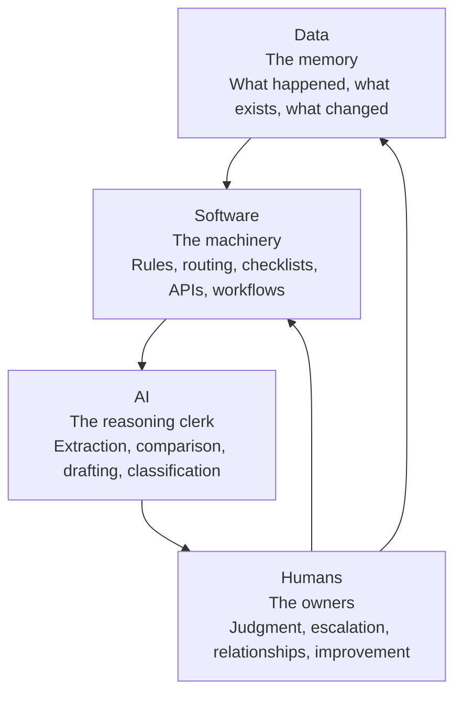
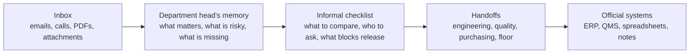
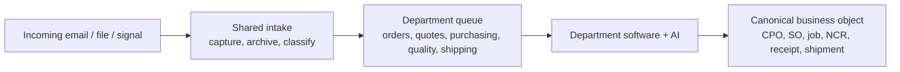
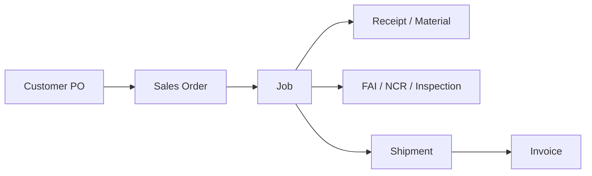
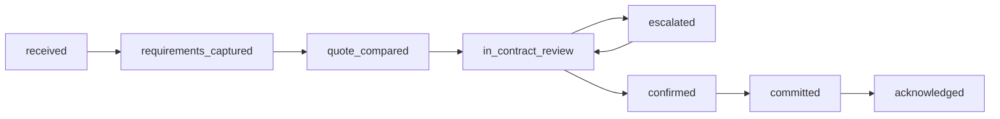
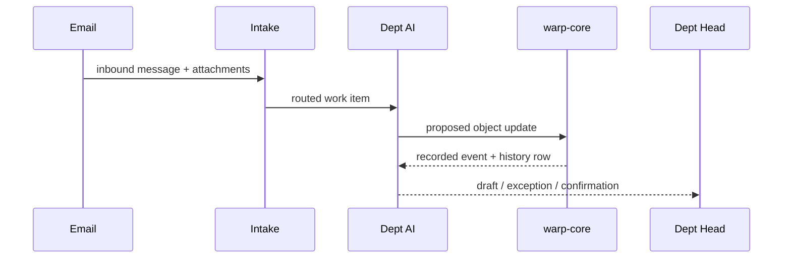
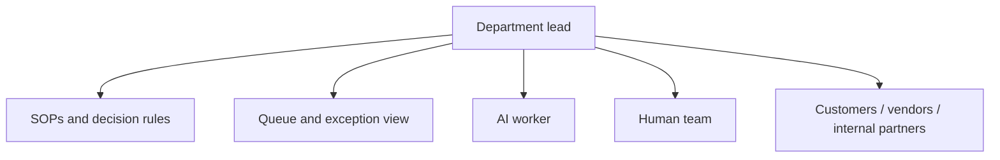
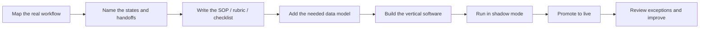

# Department Head Briefing

Slide-shaped working draft for explaining the FFMFG operating-model transformation to department leads.

Use this as:
- a live walkthrough in a meeting
- source material for a slide deck
- a shared vocabulary document for follow-up discussion

Audience assumptions:
- deep domain knowledge
- high technical fluency in manufacturing and operations
- not expected to think in software architecture terms day-to-day

---

# Slide 1
## What We Are Actually Building

We are not just building software.

We are making the way each department already thinks, checks, escalates, and hands off work visible in a system that can:

- remember accurately
- route work consistently
- show history clearly
- let AI help without hiding accountability

The goal is not "replace the department head."

The goal is:
- make the software hold the routine structure
- let AI do bounded transactional work
- keep humans on ownership, judgment, customer trust, and improvement

---

# Slide 2
## The Four Layers

Plain-English version:

- `Data` is the memory of the company.
- `Software` is the machinery that moves work the same way every time.
- `AI` is the reasoning layer for fuzzy tasks.
- `Humans` remain the accountable owners of the work.

---

# Slide 3
## What Each Layer Means In Practice

| Layer | In department language | Example |
|---|---|---|
| `Data` | The official record | the customer PO, the sales order, the job, the NCR, the FAI |
| `Software` | The repeatable procedure | route this email, create the object, check required fields, enforce status rules |
| `AI` | The assistant that can interpret messy inputs | read a PDF PO, compare it to the quote, draft the acknowledgment |
| `Humans` | The accountable decision-makers | decide if risk is acceptable, handle exceptions, improve the SOP |

What changes is not the work itself.

What changes is that the structure of the work stops living only in people's heads.

---

# Slide 4
## This Already Exists Today - Mostly In People's Heads

The transformation is not inventing a new job.

It is turning this invisible internal workflow into a visible, auditable, assistable system.

---

# Slide 5
## How Work Enters The System

Think "mailroom," not "magic AI."

What the queue does:
- makes work explicit
- prevents dropped balls
- separates intake from department logic
- gives a clean place for shadow mode, retry, and audit

---

# Slide 6
## Business Objects Are The Spine

We are not building a fake "task system" on top of the business.

The work is the state change of the real business object.

This matters because it means:
- the record people care about is the same record the software works on
- the audit history is attached to the real object
- handoffs happen through shared business reality, not side notes

---

# Slide 7
## Example: Orders As A State Machine

This is already what Lex or Lino is doing mentally.

The new move is:
- name the states
- name what causes movement
- name what blocks movement
- name when AI can act and when a human must step in

That state machine becomes:
- a software workflow
- a training aid
- an SOP
- an eval target for the AI

---

# Slide 8
## Audit History: What Happened, Who Did It, Why

For every meaningful action, we want to be able to answer:

- What came in?
- What did the system extract?
- What did the AI decide?
- What record changed?
- Who approved it, if approval was needed?
- What was the exact history of that object over time?

This is not just for compliance.

It is how we make AI assistance trustworthy.

**Under the hood, every fact the AI produces is an *assertion*, not a fact** — it carries:
- **how** it was established (measured, computed from the model, AI-inferred, human-authored)
- **how confident** the AI is
- **what it was based on** (the drawing, the model, the cert)
- **whether a human has verified it** — and who signed

A measured dimension and an AI-guessed thread callout do not look the same in the record. An unverified AI reading is a *candidate*, not a fact. The verification — a person confirming or correcting — is itself a permanent, signed record. (This is the ontology's provenance-and-verification substrate; in aerospace it is what lets us put AI on real work without losing the audit trail.)

---

# Slide 9
## The New Role Of The Department Head

The department head is not being reduced.

The department head is being elevated from processor of work to leader of a mixed crew.

The new job becomes:
- define the real process
- define the risk and escalation rules
- review exceptions
- improve the SOP from what the system learns
- own relationships and hard calls

---

# Slide 10
## What Stays Human — And How the Balance Shifts

AI can help with:
- extraction
- comparison
- drafting
- classification
- routine follow-through

Humans keep:
- accountability
- customer judgment
- exception handling
- cross-department conflict resolution
- policy changes
- deciding what "good" looks like

If a case is novel, risky, sensitive, or trust-heavy, the system should surface it faster to the human, not bury it deeper.

**Where this is heading.** Today the posture is *AI-assisted humans*: AI does the mechanical work, a person does the cognitive work and verifies everything. As the AI's track record builds on each kind of work, the verification gate narrows — from *review everything* to *review the exceptions* (low confidence, key characteristics, novel parts). The AI takes on more of the cognitive work; the human reviews the residual.

The end state we are building toward is **human-supported AI**: the AI runs the routine loop of a department end to end, and the human's job concentrates into verification, judgment, and ownership of AI-produced work — moving from *doing the work* to *owning and signing the work*.

The key point for department heads: **what is permanent is your accountability, not the chore of checking everything.** As the AI earns its track record, the verifying narrows from *everything* to the exceptions — and where it proves demonstrably safer than doing it by hand, you should lean on it (autopilot, not the pilot). What never goes away is the signed, auditable seam where *you* own the outcome. In our world (AS9100, ITAR) that seam is structural — it answers to a regulator and a customer, not to how good the AI gets. What changes is not whether you're in the loop; it's that you move to the top of the loop. The system is being built so that seam is always there and always inspectable.

**Concrete example (Engineering@):** a customer sends a 3D model and a drawing. The AI recognizes the features, reads the GD&T, and proposes a routing — every item stamped with how it knows and how confident it is, dimensions measured off the model (never guessed). The engineer reviews and signs; conflicts (e.g., a thread the AI couldn't read off geometry) are surfaced, not buried. That signed review is the record. That is the CAM-programming front of the thread becoming a human-supported-AI loop.

---

# Slide 11
## How A Department Gets Brought Online

This is why we keep saying the push has to be coordinated:
- requirements
- SOPs
- data model
- vertical software
- AI evals

They should move together by department.

---

# Slide 12
## What We Need From Department Heads

We do not need software architecture from them.

We need the truth of the work.

The highest-value inputs are:
- the real states of work, not the simplified ones
- what makes a case risky
- what causes an escalation
- what information must be present before commitment
- what a "clean handoff" looks like
- what mistakes are expensive or embarrassing
- what an excellent outcome looks like

Their domain knowledge becomes the source material for:
- SOPs
- system rules
- AI prompts
- eval sets
- dashboards

---

# Slide 13
## The Message To The Team

The transformation is:

- not "AI replaces the department"
- not "software people redesign your work from outside"
- not "one giant ERP rollout"

It is:

- your department logic made visible
- your best judgment turned into reusable structure
- your history made inspectable
- routine work pushed down into software and AI as fast as it's made legible
- humans freed up for ownership, relationships, and improvement

---

# Slide 14
## Suggested Discussion Questions

Use these to run the first real meeting with department leads:

1. What are the real states of work in your department?
2. Which transitions are routine, and which are risky?
3. What information do you always look for before you move something forward?
4. What exceptions force you to pull in another department?
5. Which decisions could AI draft safely, even if a human still approves them at first?
6. What mistakes must the system never make silently?
7. If we gave you one queue view and one history view, what would need to be on them?
